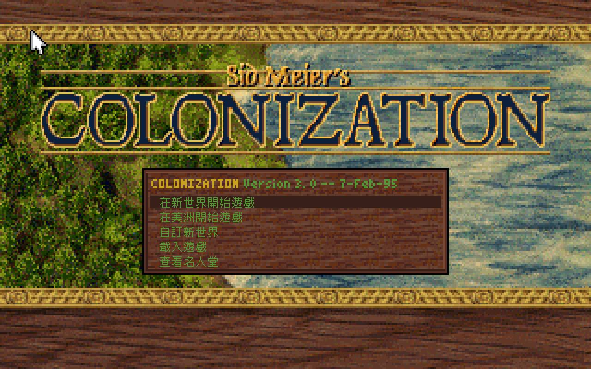
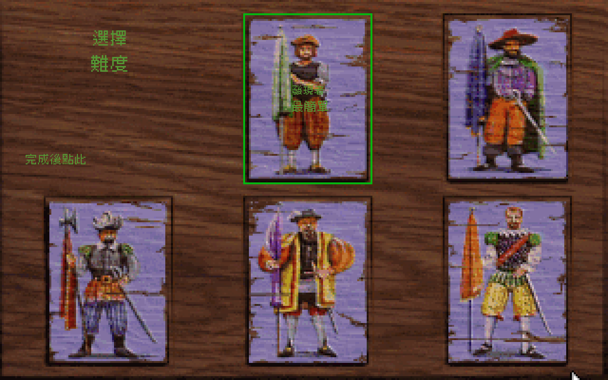
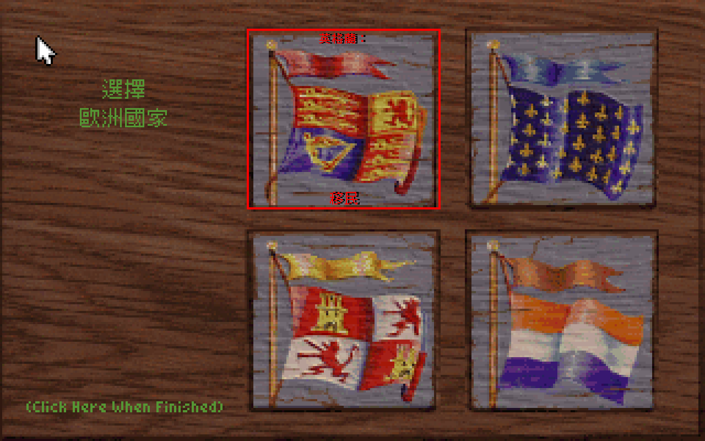

# 《殖民帝國》繁體中文顯示轉譯

《Sid Meier's Colonization》（1994）是經營殖民地、調配資源與貿易，並在不同勢力間作出治理選擇的歷史策略遊戲。本專案的目的，是降低語言隔閡，讓繁體中文玩家能直接理解遊戲中的選單、訊息與說明。

這不是重製版（remake）。原版 DOS 程式、規則、資料及存檔保持原樣，由 [dosgolem](https://github.com/wicanr2/dosgolem) 執行；本專案只在輸出畫面階段辨識原版文字，於放大畫布疊上繁體中文。動態印字與烘入圖像的靜態文字都在研究範圍內，但只有取得原版事件、來源與安全矩形證據的內容才會啟用覆蓋；不符時保留原文。

## 畫面

主選單：五列選項已由原版印字事件觸發中文覆蓋。畫面來自合法 DOS 版、dosgolem 正常冷啟動及 Ebitengine 真視窗；原版大型標題仍保持英文。

難度頁：圖中展示依原版兩行共同中心線排版的「選擇／難度」、原樣保留的「完成後點此」提示，以及第一張卡片的「發現者／最簡單」。兩行標題分別採34／38px；第二張卡片的「探險家／簡單」亦已完成真視窗驗收，但不在這張截圖中。其他卡片與英文字仍待驗證。

國家頁：左側標題與第一張旗卡的「英格蘭：／移民」已中文化；旗卡兩行依原版字高分別使用21／25px，紅字與黑影保留原版風格。相鄰旗卡與其他國家仍是原文。這三張圖只證明有限玩家路徑的顯示，不代表完整遊戲已中文化。

這三張截圖含原版遊戲畫面像素，僅放在目前的**私有研究儲存庫**；尚未取得公開散布判定，不得轉入公開發行包。

## 目前狀態

已驗證從原版 `OPENING.EXE -g` 啟動、進入 `VICEROY.EXE` 主選單，再以真實 DOS 滑鼠點選「新世界」、難度頁完成區與選國頁完成提示，抵達姓名畫面；正常鍵盤輸入及 Enter 亦能進入第一段國家介紹。現有十七段中文畫面文字：主選單五列、難度頁標題兩段、完成提示一段、第一及第二張卡片各兩行、國家頁左側標題與第一張旗卡各兩行，以及姓名頁的固定提示一段。可編輯姓名與介紹長文仍保持原文。這些有限欄位的 Ebitengine／Xvfb 真視窗以同一份輸入重播中英文兩組，原版 CPU、完整 RAM、索引畫面、色盤及虛擬時間一致；新增畫面差異只在已驗證的中文安全區。第一張旗卡需本機已驗字模並明確開啟 `--nation-card-a`；此字模尚不能從 Git 獨立重烘或公開發行。

[繁中翻譯草稿](text/draft.zh-Hant.tsv)現有368筆可追溯候選（新納入28項地圖編輯器選單、14個過場標題與2則載入訊息）；另有[163 篇百科原文／繁中對照（25篇建國元勳、16篇貨物、24篇單位、29篇地形、27篇職業、42篇建築）](text/pedia-bilingual.tsv)、[24 則教學與地圖編輯說明的原文／繁中對照](text/help-bilingual.tsv)、[7 則版本3玩家補充說明的原文／繁中對照](text/readme-bilingual.tsv)、[173 筆預設殖民地名稱的原文／繁中對照](text/colony-bilingual.tsv)，以及[英格蘭、法國、西班牙、荷蘭各兩節共八節介紹雙語草稿](text/nation-introduction.zh-Hant.tsv)。它們都只是可追溯的譯稿；僅法國兩節有原版正常路徑印字證據，介紹長文及說明文字尚未接入中文實際畫面。靜態圖中文字、其他選單、完整操作及整局遊玩都未完成；請以[目前狀態](CONTEXT.md)為準，不以譯稿筆數推算畫面完成率。

目前沒有可下載的正式中文化版本。現有 Linux／Xvfb 程式是可撤回的驗證原型，不具備完整鍵盤、音訊、存讀檔與正式玩家節奏。

## 研究與執行入口

需要自行持有合法 DOS 原版。所有建置、遊戲執行、分析與抓圖都在 Docker 容器內進行；本案只使用 `workplace/dosgolem` 的獨立副本，不修改共用專案。視窗原型由 [組裝器](tools/build_window_prototype.py)及[真視窗驗證腳本](tools/probe_window_prototype.sh)產生；固定工具鏈、掛載與驗證契約見[視窗原型規格](docs/spec/013-window-prototype.md)，難度標題的輸出守門與版式分別見[規格014](docs/spec/014-difficulty-text-output-draft.md)及[規格018](docs/spec/018-difficulty-heading-layout-draft.md)，第一、二張卡片兩行分別見[規格017](docs/spec/017-first-difficulty-card-overlay.md)與[規格019](docs/spec/019-second-difficulty-card-overlay.md)，國家選擇頁左側兩行見[規格020](docs/spec/020-nation-heading-overlay.md)，第一張旗卡兩行見[規格021](docs/spec/021-nation-card-red-text-draft.md)，姓名固定提示見[規格023](docs/spec/023-player-name-screen-draft.md)。

- [目前脈絡與未完成界線](CONTEXT.md)
- [工作計畫](WORKLIST.md)（由 `docs/worklist.json` 產生）
- [研究證據](RESEARCH-LOG.md)與[工作歷程](WORKLOG.md)
- [專案規則](AGENTS.md)

## 權利邊界

原版 EXE、資料檔、字型、音樂、存檔與解包輸出不加入 Git 或發行包。截圖與原文的公開散布、字型授權、正式封裝及全遊戲完成標準仍待確認；私有研究成果不等於公開發布許可。本專案與原作權利人沒有隸屬關係。
