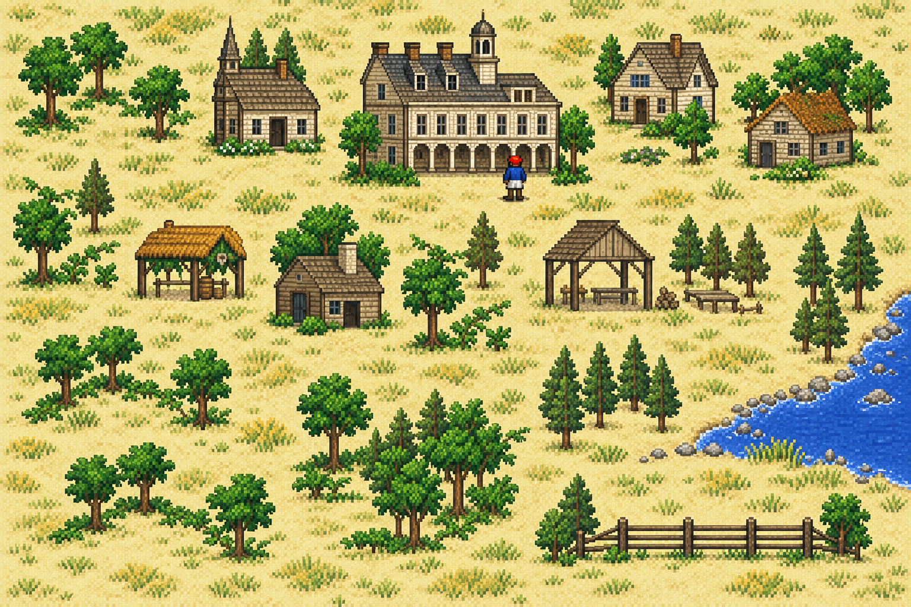

# 多語系、圖像 HD 與實際遊玩影片

狀態：HD 畫風與畫面外設定入口已確認；資產定位及正式合成規格進行中。

本輪承接使用者於 2026-10-10 的新增要求。已發布的
v.1.0.3-20261010 與 #56 完成紀錄保留；本頁不代表新增功能已完成。
未完成項由 [工作清單](../worklist.json) 掛接 GitHub Issue。

工作入口：[五語與英數字型 #62](https://github.com/wicanr2/colonization_cht/issues/62)、
[HD 重繪 #63](https://github.com/wicanr2/colonization_cht/issues/63)、
[實際遊玩影片 #64](https://github.com/wicanr2/colonization_cht/issues/64)。

## 已確認的要求

| 項目 | 使用者決定 |
|---|---|
| 語言 | 保留繁中，新增簡中、日文、韓文、英文，提供切換。 |
| 字型 | 英文模式使用原版字體；其他語言內保留的英文字母與數字使用該語言的顯示字型。 |
| 圖像 | 重繪地形、人物與建築。使用者於2026-10-11定稿第一張精細像素風，並要求原圖加入儲存庫、決定寫入AGENTS.md。 |
| 操作 | 2026-10-11確認採用畫面外設定列，可在遊玩中切換；開設定時暫停，關閉且按鍵放開後恢復，不占原版快捷鍵。 |
| 影片 | 推廣影片必須包含實際遊玩的連續動態畫面。 |
| README | 加入遊戲背景、殖民題材起源與當年北美移民情況。 |
| 交付 | 沿用本對話的 commit、push、三平台完整版與 Release 要求；新版須另建固定版本，不覆寫既有發行。 |

## 已查證的邊界

以下為目前程式可回查的 confirmed 事實，不是新版完成證據。

- [原版畫面合成](../../tools/live_menu.go) 在 `render` 內讀取 320×200
  索引畫面及色盤，對照組直接整數放大四倍；中文組經 `overlay.ComposeLayers`
  及後續覆蓋產生 1280×800 畫布。
- [前端](../../tools/window_prototype.go) 的 `Layout` 固定為 1280×800，
  `logicalMouse` 以座標除以四映回原版。F1～F10、方向鍵、數字鍵盤與部分
  Ctrl／Alt／Shift 組合已送進 DOS，不宜另拿來當設定快捷鍵。
- 現行 13 份文字資料與 67 份字模資產只提供繁中。各覆蓋層仍有獨立的資料、
  字型雜湊與排版契約，不能只換一個語言旗標就稱為五語支援。
- [Cubic 11](../../font/README.md) 的固定 SHA-256 為
  `8de9c249b92bc414cb73f09ddb76c7cb327edb3907b638f0d0bd22691237fd5c`。
  本輪用 Pillow 9.4 抽查 `A0%漢汉あア한글`；`한`、`글` 的遮罩與未定義碼點
  U+10FFFF 相同，其他抽查字元不同。這只證明抽查缺字，不等於完整字形清冊。
  該容器不作正式字模烘製工具。
- v.1.0.3 的影片是已揭露的截圖混剪。現有 PNG 與輸入收據能支援新錄影查證，
  不能直接改名當成連續遊玩影片。

## 決策樹

```text
使用者已確認：五語、英文原字體、HD 可切換、保留原版操作
├─ HD 第一階段：重繪地形、人物與建築，先做風格樣張（已確認）
│  └─ 第一張精細像素風已定稿並入庫；接續資產定位、分層、來源與效能規格
├─ 設定入口：畫面外工具列，遊玩中切換（已確認）
│  └─ 開設定暫停、關閉及按鍵放開後恢復；接續輸入隔離證據與預設值
└─ 字型與語料：先盤點，再展示日韓候選與最長文案排版
   └─ 確認字型後，建立分語言資料包與逐欄規格
```

畫風與設定入口已確認。[規格050](../spec/050-display-settings.md)授權前端設定狀態、輸入隔離與音訊暫停。
語言包、字型與HD合成仍待各自的證據與規格，不因設定入口定案就視為可用。

## 切換介面的建議

已確認在遊戲區上方增加獨立、可辨識的「顯示設定」工具列。遊戲區仍維持
1280×800 及原有比例，工具列另佔高度。設定面板提供語言與圖像模式兩個選單，
以及套用、取消；各語言以自己的名稱顯示。保留命令列啟動設定作為備援。

不佔原版選單、不改遊戲內按鈕，也不新增全域快捷鍵。正式實作需處理：

| 情境 | 建議契約與驗證 |
|---|---|
| 開啟設定 | 若原版仍收到按住的滑鼠或鍵盤，先完成原有放開事件，再在 Update 邊界暫停；不得中斷拖曳。 |
| 設定開啟 | 由前端獨占鍵盤、滑鼠、滾輪與 Escape；不呼叫 `applyWindowInput`，也不推進 DOS 指令。 |
| 關閉設定 | 等實體按鍵與滑鼠按鈕放開後恢復轉送，避免套用點擊穿透或 Escape 關閉原版對話框。 |
| 音訊 | 暫停與恢復須與獨立原速音樂協調，避免積壓與爆音；目前尚未證實，不先宣稱可直接沿用。 |
| 縮放與邊界 | 先扣除工具列與留白，再將遊戲區映回 320×200；區外操作不送 DOS。 |
| 設定保存 | 保存在前端使用者設定位置，與 DOS 存檔及遊戲原始目錄分開；明確參數優先於保存值。 |

工具列的高度、全螢幕行為及保存檔格式尚未定版。48px 只是操作原型尺寸。
原型沒有執行原版，不能作為上述正式契約通過的證據。

## 多語系與字型的建議

維持現有原版來源鍵與占位符契約，語言只決定顯示資料。先建立語言清冊，
每種語言整包綁定譯文、術語、變數顯示值、靜態文字覆蓋、字形、排版與雜湊。
不把繁中檔名當作共用 API，也不修改原版 TXT、EXE、存檔或語意比較值。

| 語言 | 顯示方式建議 |
|---|---|
| 繁中 | 已展示Cubic 11與Noto Sans CJK TC候選；新版字型待選，補齊保留英數的可追溯繪字欄位。 |
| 簡中 | 以繁中稿作起點，逐項校對術語、占位符與缺字；文字轉換不當作翻譯驗收。 |
| 日文 | 獨立譯稿與字形清冊；Cubic 11 的假名抽查通過，尚未證實全部日文覆蓋或區域字形適合。 |
| 韓文 | 另選具有完整所需韓文字形的字型；Noto CJK KR 可作候選，需確認版本、授權與實際排版。 |
| 英文 | 直接顯示原版文字與字體，保持現有英文來源。若搭配 HD，原版字形需在圖像處理後獨立呈現。 |

字型候選來源：[Noto CJK 官方專案](https://github.com/notofonts/noto-cjk)。
已從官方固定commit下載Sans2.004的Regular OTC與OFL授權至本機，未加入Git或發行包。
`workplace/reports/goal186-display-hd/font-candidates/sources.json`保存來源及雜湊；
`font-comparison.png`用真實字型呈現四語與英數，已展示給使用者，字型選擇仍待回答。
樣張以Pillow9.4.0生成，只作字型比較，不代替各欄正式排版或完整缺字驗收。
可用[字型樣張工具](../../tools/render_language_font_sample.py)重生：在既有Go／GUI容器內
以`--cubic`、`--noto`、`--license`指定上述固定TTF、TTC與OFL檔，`--output`指定新的
workplace子目錄。工具核對三份SHA-256、真實字形、樣張寬度與擁有權，拒絕覆寫。

切換先完整驗證目標語言包，再於單一畫面邊界整包交換；缺檔、版本不符或載入
失敗時保留目前設定並顯示原因。原版來源觀測與顯示語言分離，從原始畫面重新合成，
清除上一語言的顯示快取；不得藉由重啟原版、假按鍵或強制翻頁完成切換。
當前畫面若缺少足夠來源證據，該欄先回原文並記錄，等原版正常重畫再恢復覆蓋。

每欄重新量測字高、基線、安全矩形、最長文案與數值寬度。城市名、路線名、
日期、金額、百分比、數量與輸入框內容均納入英數盤點；烘在圖像裡的英數走
靜態清冊。不能因字型已含 ASCII，就宣稱原版英數全數改用新字型。
原版可輸入字元的限制仍保留，不把切換介面語言宣稱為新增日韓輸入法支援。

## 圖像 HD 的建議

使用者已定稿第一張精細像素風，用於地形、人物與建築重繪。
決定與後續遵循方式見 [AGENTS.md](../../AGENTS.md#hd-重繪定稿)。
接續盤點資產定位、動畫、圖層遮擋及正式素材的公開權利。
事件版畫尚未納入這次選定的素材範圍。

### 定稿畫風與來源



- 原圖：[hd-pixel-concept.png](../screenshots/hd-pixel-concept.png)，1536×1024，保留生成時的原始位元組。
- SHA-256：`d9d89edec99584f4032f16a48000aef46d0248b06f85b31418c0f3a81a3ea2bf`。
- [圖片紀錄](../screenshots/hd-pixel-concept.json) 保存生成工具、完整提示、參考圖雜湊與定稿日期。
- 圖片於2026-10-10透過 `imagegen` 生成，使用本機殖民地畫面作構圖、視角與配色參考。
  使用者於2026-10-11明確授權此草稿入庫；原版參考截圖未隨圖加入。
- 本次選定畫風。正式素材沿用原版已證實的位置與互動範圍；本圖尚未逐幀對齊遊戲資產。

保留「原始像素」作為切回選項。原型中的
[Scale2x／Scale4x](https://www.scale2x.it/algorithm) 只供比較邊緣處理，
不能當作本次重繪 HD 的交付，也不能取代風格樣張。

建議的正式分層為：原版索引畫面與經證實的文字清除結果 → 圖像處理 →
當前語言文字 → 原版游標 → 前端設定介面。現有合成器把清除與文字繪製結合，
分層介面仍需 DRAFT／READY 規格，不能直接對完成的中文畫面套濾鏡。

HD 與語言互相獨立，使用同一組原版輸入座標。圖像處理只改輸出，不寫回 VGA、
RAM、調色盤或原始資料；無法安全識別文字／游標的區域維持原始顯示並記錄。
處理失敗時回到原始像素模式，原版繼續原有狀態。

正式重繪建議以地形、建築、人物各自的素材單位接入，綁定已證實的原版來源、
檔案雜湊、繪圖呼叫、動畫幀、目的矩形與遮擋順序。HD素材依原版目的矩形放大四倍，
輪廓與透明邊界另驗安全範圍，遊戲的點擊矩形仍由原版決定。需要清除原圖的地方，
先取得該次繪製的前後差分與底圖證據，再做非破壞性的顯示替換；後續原版重畫或
遮擋發生時撤銷過期覆蓋。樣張新增的塔樓、細節與間距不自動成為正式素材定位。

素材清冊與上述呼叫證據尚待建立，先取一座建築、一種地形及一個人物的正常路徑
做垂直驗證。通用合成能力只在規格READY後放進本專案的隔離dosgolem；
遊戲專屬來源與座標留在本儲存庫。正式素材使用已確認、可驗雜湊的本機資料包，
遊玩時直接載入，避免以即時生成圖像影響輸入延遲與畫面一致性。

首座候選由[透明輪廓檢查器](../../tools/check_hd_candidate_geometry.py)只讀量測。
以`--original`指定指紋相符的BUILDING.SS，`--decoded`指定盤點器第032幀PNG，
`--candidate`及`--metadata`指定生成候選與來源紀錄，`--output`指定新的workplace JSON。
工具核對原版、解碼索引與候選雜湊，量測92×108目的畫布的alpha覆蓋及外溢；
不修改圖片，量測數字不作正式素材或畫質驗收通過門檻。

資產盤點入口：[研究用SS盤點器](../../tools/inventory_hd_assets.py)。工具以固定
`mpskit` commit與來源清冊雜湊核對外部解碼器，讀取實際檔案數、圖像數、尺寸及索引像素雜湊。
解碼圖片、接觸表與清冊只輸出本機`workplace/reports/goal186-display-hd/`；
圖像身份、繪圖呼叫與動畫需再由正常路徑驗證，解碼數量不計為HD完成數。
以 [完整像素定位器](../../tools/locate_hd_assets.py) 對照320×200原始索引畫面，
逐一核對整張不透明像素；只記錄完整可見候選，不用相似度門檻推測遮擋中的素材。
繪圖來源接續 [畫布寫入探針](../../tools/probe_hd_canvas_writes.go)，從既有正常GUI輸入
重播並觀測一座已定位建築的原版寫入指令、暫存器與堆疊；另跑無觀測對照，
不修改原版RAM、不注入遊戲狀態。寫入位置尚未等同完整繪圖呼叫契約。

## 可丟棄原型與重跑入口

原型來源：[HTML 介面](../../tools/prototype_display_settings.html)、
[本機組裝器](../../tools/build_display_settings_prototype.py)。
含原版像素的組裝結果只留在已忽略的
`workplace/reports/goal185-player-experience/display-settings-20261010/`。
公開原型程式碼不嵌入原版圖像與字型資料；定稿生成樣張另由上方入口保存。

原型提供畫面外工具列、五個語言選項、設定面板與座標紀錄，並以同狀態的繁中／
英文城市畫面示範切換。簡中、日文與韓文會明示未提供遊戲譯稿，不冒充已翻譯。
HD 比較只涵蓋建築區，尚未驗證完整場景、動態穩定性與效能。

最初兩張重繪風格候選保存於同一本機目錄：`hd-pixel-concept.png` 為精細像素風，
`hd-painted-concept.png` 為手繪插畫風，均為1536×1024。它們使用實際殖民地畫面作
構圖參考，透過 `imagegen` 生成，沒有保留原版座標精度，不是可直接換入的遊戲素材。
完整生成提示保存於`hd-sample-prompts.json`；來源、SHA-256 與缺字抽查記錄在
`prototype-evidence.json`。第一張已依使用者定稿與入庫指示原樣保存至
`docs/screenshots/hd-pixel-concept.png`，完整提示與來源另記於同名JSON。
未選用的手繪插畫候選及含原版截圖的HTML繼續只留本機。Issue 建檔全文同留此目錄的 `issue-*.md`。

在既有 Go／GUI 工具容器內，將本專案掛到 `/repo`，輸出目錄明確可寫，執行：

```bash
python3 /repo/tools/build_display_settings_prototype.py \
  --zh /repo/workplace/reports/goal185-player-experience/issue56-wagon-sample-zh/run.cp-75900000.png \
  --english /repo/workplace/reports/goal185-player-experience/issue56-wagon-sample-control/run.cp-75900000.png \
  --output /repo/workplace/reports/goal185-player-experience/display-settings-20261010/index.html
```

輸出拒絕覆寫，來源圖必須是 1280×800；先檢查輸出目錄 UID/GID。
用本機瀏覽器開啟輸出 HTML 可操作。自含原版截圖，不上傳、不進 Git。

## 實際遊玩影片與交付

沿正常玩家操作錄製新局移動、殖民地操作與貿易等連續片段。保留真實輸入、
畫面時間、模擬步數、程式版本、原始影片與原版音訊的雜湊。
優先沿用 Xvfb 與 FFmpeg 錄製實際前端，不能用靜態圖平移放大充當遊玩。
字幕放在遊戲區外；剪接、加速與畫面模式須可回查。

沿用 90 秒、1080p、30fps 的已定交付尺寸。新增片段先取得動態擷取證據，
再修訂 [規格044](../spec/044-release-and-promo.md) 的靜態分鏡與凍結判準。
檢查連續遊玩區間的實際變化、音訊非靜音、黑幀、異常凍結、字幕裁切與素材來源。
本輪已產生錄影原型，尚未完成新90秒成片，不把舊影片的驗收外推到新要求。

### 動態錄影原型

`workplace/reports/goal185-player-experience/gameplay-clip-20261010-r2/`
保存51.933秒、1280×800、30fps、1558幀的真實X11錄影。
以現行v.1.0.3正式二進位8e6cba67…，正常載入合法COLONY09，依序進殖民地、
開建造清單、選貨車、查看購買提示及返回世界。40筆正常輸入，終點126600000步，
沒有輸入或記憶體注入。原版資料唯讀。

錄影工具為既有hr-go-ebiten映像1430a2cf…內的Xvfb、xdotool及FFmpeg。
本機腳本`display-settings-20261010/capture_gameplay_clip.py`與`capture_probe-*.py`
保留啟動器、正式二進位指紋、實際鍵鼠順序、有界錄影及關窗流程；容器使用UID1000、
2CPU、3GiB、128PID及300秒外層逾時，Xvfb有trap，結束後無殘留容器。

| 證據 | 結果 |
|---|---|
| `capture.json` | 程式、初始存檔、輸入、錄影及原版WAV雜湊，操作時間與限制。 |
| `clip-check.json` | `PASS_ACTUAL_CAPTURE_PROTOTYPE`；每秒兩幀共104個抽樣，93個不同畫面，93次相鄰變化。 |
| `gameplay-x11.mp4` | SHA-256 `6782bef648a816477530a9fd250f18aa3452b3f8618137ef6e297d88771fd4b0`。 |
| `gui.inputs.json` | SHA-256 `5ecd215accf2d26c7e4983ac66668fd2681ca41ea806dc681f1475c366867fbf`。 |
| `raw.wav` | 原版前端音訊10.932秒，49,715Hz雙聲道，平均−32.6dB、峰值−11.4dB，非靜音。與52秒牆鐘錄影不同步，不能直接當作同步成片音軌。 |

已目視城市、建造清單及購買提示三張觀察截圖，操作到達預期畫面。
這些截圖未鎖定模擬步數，不作新增同狀態對拍收據。
影片尚無音軌、字幕與90秒正式剪輯；尚未驗正式成片的黑幀、異常凍結與人耳效果。
第一場已關窗，但驗證腳本誤將關窗文字提示當成JSON；修正解析最後一行後，
在同一映像與操作流程用新輸出目錄乾淨重跑成功，原失敗輸出保留。

## 實作順序與退出條件

研究工具驗證入口：[check_goal186_research.py](../../tools/check_goal186_research.py)。
在Docker內以`--game`、`--decoder`、`--frame`指定唯讀合法原版、固定mpskit與
原版320×200收據，`--output`指定新的workplace子目錄；缺原版回傳77。
此工具只驗證盤點、完整像素定位及失敗守門，不增加正式HD或五語完成信用。

1. 完成 README 歷史背景與來源，建立新增 Issue、資料清單與可操作原型。
2. HD 方法與精細像素畫風已確認；接續資產盤點、設定操作確認及必要的日韓字型樣張。
3. 建立 READY 規格，先做繁中／英文、主選單／世界／殖民地的一條完整切換路徑。
4. 接入簡中、日文與韓文的完整顯示資料，逐語言驗長文、英數、停用選項、缺字回退。
5. 同初始狀態與等價輸入下，比對英文、各語言、HD 開關的 CPU、RAM、索引畫面、
   調色盤與存檔；正常 GUI 驗證拖曳、設定取消、切換後操作與存讀檔。
6. 錄製新遊玩影片，按已確認的交付範圍乾淨重建三平台，驗 manifest、SHA-256、
   啟動、素材與授權，再 commit、push 及建立新版本 Release。

五語選項可點不等於五語完成，單張 HD 圖不等於所有圖像已 HD 化。
macOS 真機、音效卡與人耳驗收沿用現有限制，不能用 Linux／Wine 結果取代。

## 資產與繪圖觀測

本機輸出根為`workplace/reports/goal186-display-hd/`，原版圖像與原始觀測不入Git。
研究工具為[inventory_hd_assets.py](../../tools/inventory_hd_assets.py)、
[locate_hd_assets.py](../../tools/locate_hd_assets.py)及
[probe_hd_canvas_writes.go](../../tools/probe_hd_canvas_writes.go)。
工具不接入正式前端，不修改原版資料或記憶體。

| 證據 | 結果與限制 |
|---|---|
| `research-check-20261011/inventory/inventory.json` | 206個SS、1517幀、1498個非空幀，無失敗檔。四份焦點SS輸出345張本機候選圖，不由檔名猜測遊戲用途。 |
| `research-check-20261011/placements.json` | 殖民地75900000步：42種素材、71處完整不透明像素匹配。建築032為23×27，矩形[56,13,79,40]。 |
| `world-63525000-placements.json` | 正常世界畫面16種素材、139處匹配，含108處PHYS0.SS第148幀海面。局部遮擋不採相似度猜補。 |
| `building-032-source-proof.json` | 原版0D46:01D2的來源緩衝與BUILDING.SS第032幀的part3位移22616完整534bytes全同，該段在part3唯一。原版CS:IP、線性RAM與解壓part位移分別記錄於RESEARCH-LOG。尚未確認完整呼叫邊界、參數與遮擋契約。 |
| 有／無觀測對照 | 75900000步CPU、完整RAM、VGA及DAC全同。畫面與既有GUI控制收據相同，完整RAM與歷史收據不同，原因仍未知，不宣稱與舊前端全面同狀態。 |
| `building-032-candidate-v1.png`與JSON | 已按定稿畫風生成實際建築候選，保存完整提示及參考來源。輪廓、透明邊界及底部色點尚待修整與驗證，不能算正式HD素材。 |
| `building-032-candidate-v2.png`與JSON | imagegen清理外圍色點，原樣保存1157×1359 RGBA，SHA-256為6b1960059e3abaaaa4bc4c4afc3ab19ebeb21d2f3336b5ba2b5fd6abad0f0476。只留本機，未代替定稿畫風。 |
| `building-032-v2-geometry.json` | 92×108目的畫布，以alpha≥128量測：7040原版不透明點中6285點有候選覆蓋，755點未覆蓋、309點在原版輪廓外。這是幾何量測，沒有以百分比門檻宣稱正式素材通過。 |

研究解碼器沿用固定mpskit commit `8c30544b51d1b4ab68f3a465784239c24b660e24`，
清冊SHA-256 `340f980355615cbe88659b72748296657982b4802ade1d41eebcc21d84af6e18`。
外部AGPL研究程式維持本機唯讀依賴，沒有複製進正式程式或公開儲存庫。

## 設定核心與隔離真視窗的驗證

[規格050](../spec/050-display-settings.md)已READY；新增設定狀態及兩條音訊暫停機制，
尚未接入正式視窗設定列。`settings-tests-r2.json`記錄174項Go測試全過、零skip，另通過
`go vet`。獨立音樂暫停五次讀取後的機器步數、完整RAM及命令佇列不變；恢復與
無暫停對照的音訊及原版狀態相同。這些是核心測試，不是五語、HD或GUI完成證據。

接續[規格051](../spec/051-display-settings-runtime-prototype.md)的隔離執行原型，
以真視窗驗設定列及繁中／英文即時切換。前端五語文案唯一來源為
[frontend-ui.tsv](../../text/frontend-ui.tsv)，與五語遊戲資料包分開計算。
原型來源為[Go介面](../../tools/display_settings_ui_prototype.go)、
[實際字型與座標測試](../../tools/display_settings_ui_prototype_test.go)，
由[隔離組裝器](../../tools/build_display_settings_runtime_prototype.py)核對正式來源後
複製至新的workplace目錄。組裝器只改副本，不連入正式建置或啟動器。
真視窗操作由[設定列GUI探針](../../tools/probe_display_settings_gui.py)執行，使用已驗
冷啟動／讀檔路徑的真實X11鍵鼠；設定動作與原版DOS輸入分別記錄，只輸出本機。
GUI結束後由[原版狀態重播檢查器](../../tools/check_display_settings_replay.py)沿同一初始
存檔及實際輸入，核對原型、正式前端、原文控制的完整狀態、影像與存檔。

隔離原型已通過177Go、零skip及go vet。四組真GUI操作涵蓋按住與移動、Escape取消、
未安裝語言／HD載入失敗保留、繁中→英文→繁中及正常進城後取消。18筆設定事件在
各自暫停期間的原版步數、CPU、完整RAM、VGA、DAC、DOS輸入數及滑鼠狀態全同；
英文遊戲區逐像素等於原版輸出，沒有強制原版重畫。實際21筆DOS輸入重播至
73400000步，原型、正式前端與原文控制的完整原版狀態及存檔全同，三側重播WAV全同，
兩種繁中重播與GUI終點PNG全同。完整雜湊及尚待項見規格051的2026-10-11表。
GUI收據為`runtime-ui-gui-20261011-r2/`，重播收據為`runtime-ui-replays-20261011-r2/`。
字型、完整五語包、正式設定保存、失焦／拖曳GUI與HD合成仍待完成，規格051保持DRAFT。
